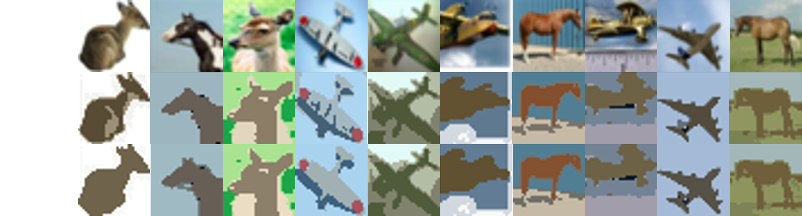

# Image Segmentation via Density-Weighted Spectral Clustering with Multi-Colour Space

## Table of Contents
- [Overview](#overview)
- [Dataset](#dataset)
- [Implementation Details](#implementation-details)
- [How to Run](#how-to-run)
- [Results](#results)
- [Ablation Study](#ablation-study)

## Overview
This project implements and compares three image segmentation algorithms: K-means Clustering, Spectral Clustering, and a novel Density-Weighted Spectral Clustering method that integrates multiple color spaces. The segmentation is performed on the CIFAR-10 dataset, specifically focusing on images of horses, deer, and airplanes. The overview of our method is shown as below:

.](readme_figures/method.png)

## Dataset
The CIFAR-10 dataset consists of 60,000 32x32 color images in 10 different classes. For this project, we focus on three classes: horse, deer, and airplane. Each class contains 6,000 images, divided into 5,000 training images and 1,000 test images.

The dataset can be downloaded from [here](https://www.cs.toronto.edu/~kriz/cifar.html).

## Implementation Details
### Algorithms Implemented
1. **K-means Clustering**
2. **Spectral Clustering**
3. **Density-Weighted Spectral Clustering**
   - Incorporates density estimation using a Gaussian kernel.
   - Utilizes RGB, HSV, and YCrCb color spaces for enhanced representation.

### Key Libraries
- Python
- NumPy
- SciPy
- scikit-learn
- OpenCV

## How to Run
1. **Clone the repository**:
    ```bash
    git clone https://github.com/YueYin27/density-weighted-spectral-clustering.git
    cd density-weighted-spectral-clustering
    ```

2. **Install the required libraries**:
    ```bash
    pip install -r requirements.txt
    ```

3. **Download the CIFAR-10 dataset** and place it in the `data` directory.

4. **Run the segmentation script**:
    ```bash
    python main.py [-h] [--method METHOD] [--output OUTPUT] [--data_path DATA_PATH] [--graph_method GRAPH_METHOD] [--k K] [--max_iters MAX_ITERS] [--sigma SIGMA] [--n_neighbors N_NEIGHBORS] [--density_sigma DENSITY_SIGMA] [--hidden_dim HIDDEN_DIM] [--epochs EPOCHS]
    ```

## Results
The comparative results of the three methods documented in the paper. Below are some sample segmentation results:

### Comparative Results


### Ablation Study


